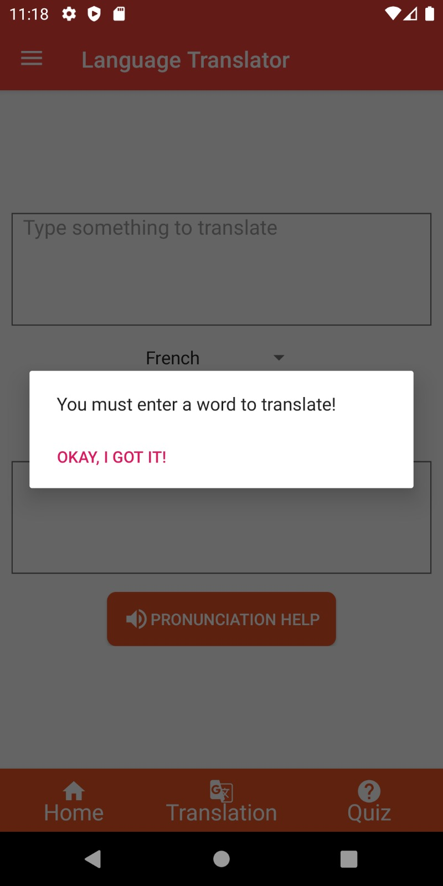

# Language Translator Documentation

  

  <h1 align="center">
  ANDROID – MOBILE APPLICATION  
  USER MANUAL
  </h1>

<ul>
<li><a href="#installation"> Installation</a></li>
<li><a href="#introduction"> Introduction to Application</a></li>
<li><a href="#translation">Translation</a></li>
<li><a href="#quiz">Quiz</a></li>
<li><a href="#inforappearance"> Application Appearnace and info section</a>
  <ul>
  <li><a href="#hoal"> How to change application language?</a></li>
  <li><a href="#hoaa">How to change application appearance?<a></li>
  <li><a href="#hqa">How to quit application?</a></li>
  </ul>
  </li>

</ul>

<article  id="installation">

## Installation:

<!-- OL -->
   
   
   

1. Open Google Play Store
1. Search “jhonr1_language_translator”  
1. Select the app  
1. Click on install  

</article>

<article  id="introduction">

## Introduction to Application

 

 After starting main application, you can see Home section screen as above. Whenever you touch on Getting Started, it will show usual information about app. Whole application majorly divied in four sections. 

1. Home

- It includes wecome message to user and basic application information and latest updates in application.

2. Translation

- it helps user to convert sentectes from english to any other language.

3. Quiz

- Quiz option provide questions and answeres in different languages.

4. Right Hover Menu

- Hover menu includes basic app related information and provide option to change application appearance.

</article>

<article id="translation">

## Translation

 
Basically translation help you convert english sentences to any provided languages. Currently software supports german, spanish, french and italian languages. Software also provide vocal pronounciation. 

### TranslationView

  In Translation section, First textbox provide user to enter enlish sentences. in middle of screen, There will spinner which provide options of languages to convert enlish sentence. There is translate button which translate english sentence or word to selected langauge.

  In Second Textbox, you can see the output of translated sentence or word. below the textbox, there is Spearker icon.  if there is no word in textbox, then it will show second image as above with message "You must enter a word to translate".

  on click of spearker icon or "Pronounciation Help", application pronounce output text in selected language. if there is no translation occurred and word is not in seond textbox then it will show third image as above with message "Enter word & translate it first!"

</article>

<article id="quiz">

## Quiz

 In Quiz section, it provide simple question answere interface in select language. it also show right answere in green mark. 

### Quiz View

in Image you can see spinner's option of language for taking quiz.

There is Start Quiz button below spinner. it takes you to quiz page which shown in next section.

### Quiz Sub View

   

in this screen, you can see question on top of screen. after that, picture of question is displyed. at bottom, Answeres is provided in terms of radio buttons. Submit button is used to give answere

After giving answere, it shows right answere if and only your answere is wrong otherwise it takes you to next question. 

 If you try to skip question without giving answere, it will show you the propmpt message "Select Any one option" so Every answere is necessary.

At the end of quiz, it will show your final score and highest score of quiz.

check above image for more explanation.

</article>

<article id="inforappearance">

## Application Appearnace and info section

this section includes settings related to application's langauge and appearance.

### How to change application language

1. Open right hover menu.
1. Click on Settings.
1. Choose the language from the list.
1. whole application langauge is changed.

### How to change application Appearance

Application provide night mode which visualy dark all the parts

1. Open right hover menu.
1. Turn on night mode.
1. Application all colors will be dark.

### How to quit application.

1. Open right hover menu.
2. Click on exit and you will see confirmation message.
3. Click on yes.
4. Your application is closed and it take you to homescreen of android.

### About us.

To open about us

1. Open side menu
2. Click on about us
3. you could see popup as above image.

 When everyou open side menu and click on about us. then it will show above Popup box with basic information.

</article>
